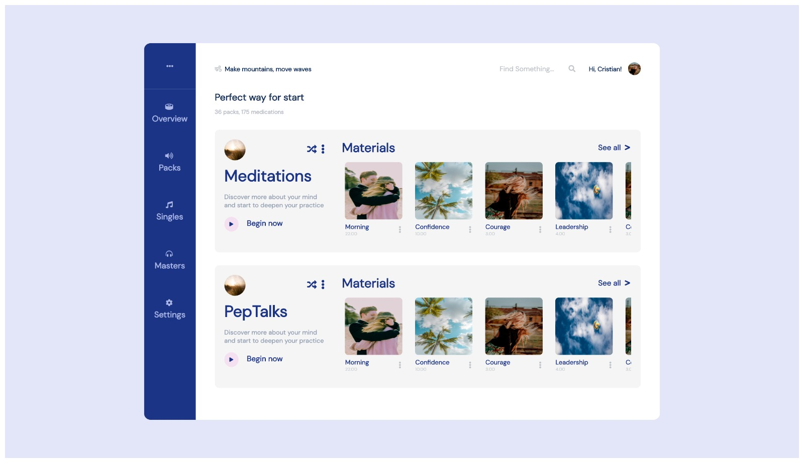

### Installation & Setup

  Clone this repository and install its dependencies.

        > git clone https://github.com/temmietope/test-ui

        > cd test-ui

        > npm install

        > npm start

  Application is live on port 3000

        http://localhost:3000

### Screenshots

### Repository

[https://github.com/temmietope/test-ui](https://github.com/temmietope/test-ui)
